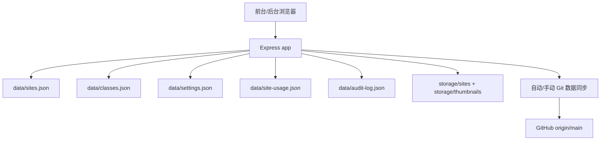
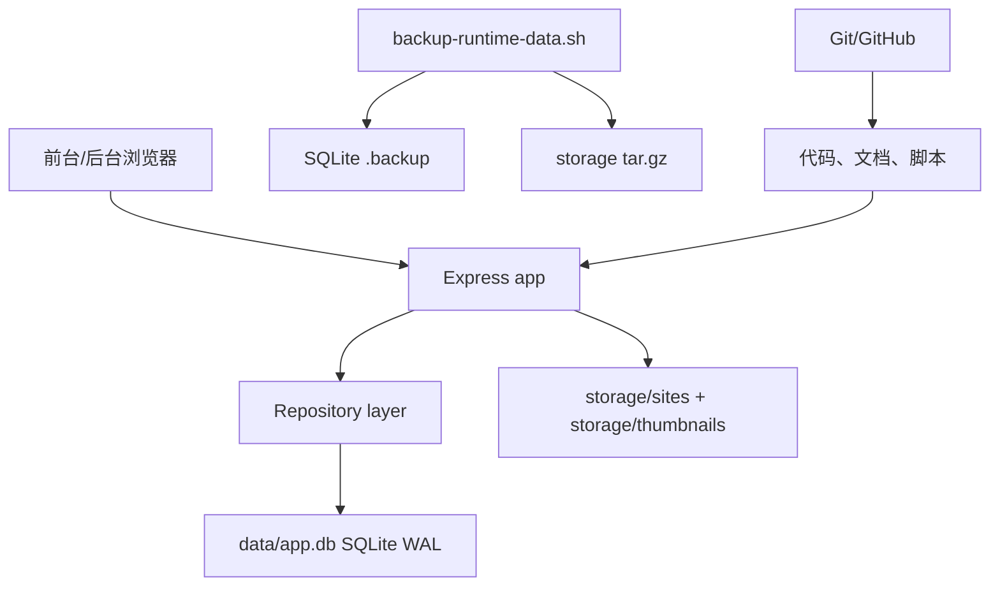

# 数据库迁移与运行数据去 Git 化软件工程设计文档

> **For agentic workers:** REQUIRED SUB-SKILL: Use `superpowers:subagent-driven-development` or `superpowers:executing-plans` to implement this plan task-by-task. 每完成一个阶段必须运行对应测试并提交一次小提交。

**目标：** 将项目元数据、班级、设置、违禁词、使用次数、审计日志迁移到 SQLite，并彻底取消“项目站运行数据进 Git”的设计，避免项目、违禁词、封面、运行数据被代码同步误覆盖。

**架构：** Git 只管理代码、文档、脚本、静态前端资源；运行数据由 SQLite 数据库和 `storage/` 文件目录承载。SQLite 负责事务化元数据，`storage/sites/<id>/index.html` 继续保存学生上传网页，`storage/thumbnails/<id>.png` 继续保存封面图。

**Tech Stack:** Node.js CommonJS、Express、`better-sqlite3`、SQLite WAL、Node built-in test runner、Supertest、PM2。

---

## 〇、文档定位

### 读者

- 负责实现迁移的工程师。
- 负责上线、回滚、服务器运维的部署人员。
- 负责后续维护数据安全、备份和恢复的项目维护者。

### 文档目标

这不是单纯的迁移备忘录，而是软件工程设计文档。它需要回答：

- 为什么要从 JSON + Git 数据同步迁移到 SQLite。
- 哪些数据进入数据库，哪些仍保留在文件系统。
- 如何保证上传、编辑、删除、审查、查重这类操作不会再次造成数据丢失。
- 如何逐步实施，如何测试，如何上线，如何回滚。
- 以后团队维护时哪些边界不能再破坏。

### 核心结论

| 事项 | 结论 | 原因 |
| --- | --- | --- |
| 代码版本管理 | 继续使用 Git/GitHub | Git 适合代码和文档，不适合高频变化的运行数据。 |
| 运行数据存储 | 使用 SQLite + `storage/` | SQLite 存元数据，`storage/` 存 HTML 和封面文件。 |
| 数据备份 | SQLite `.backup` + `storage/` tar | 备份与发布解耦，避免 `git pull` 覆盖数据。 |
| 删除项目 | 软删除 | 降低误删风险，便于恢复。 |
| 批量操作 | SQLite transaction | 违禁词审查、查重、全部解禁要么全部成功，要么全部失败。 |
| 前端 API | 保持兼容 | 迁移数据库不应要求同步重写前端。 |

### 非目标

本次不做：

- 不引入 MySQL、PostgreSQL、Redis、对象存储等新基础设施。
- 不重写前端 UI。
- 不改变现有公开 API 的响应字段，除非为了修复明确 bug。
- 不把学生 HTML 内容迁入 SQLite。
- 不实现多服务器横向扩容。
- 不把备份上传到云存储，当前先做服务器本地备份目录。

## 一、背景与问题复盘

### 当前数据分布

项目当前运行数据分散在多个 JSON 文件和 `storage/` 目录中：

```text
data/sites.json                 项目元数据
data/classes.json               班级、密码、上传权限
data/settings.json              全部密码、后台密码、违禁词、最大序号
data/private-ai-settings.json   AI API 配置
data/site-usage.json            预览和查看代码次数
data/audit-log.json             危险操作审计日志
storage/sites/<id>/index.html   学生上传网页
storage/thumbnails/<id>.png     项目封面图
```

这些数据都会在服务运行期间变化，不应该跟随代码版本回退或覆盖。

### 已暴露的问题

#### 1. 代码同步和数据同步边界混乱

当 `data/sites.json`、`data/settings.json`、`storage/sites/**` 等运行数据进入 Git 后，服务器执行：

```bash
git pull --ff-only origin main
```

就不再只是拉取代码，也可能拉取旧数据、覆盖新数据。这样会让“部署代码”变成“替换线上项目库”的高风险操作。

#### 2. JSON 多文件写入缺少事务

上传项目至少涉及：

```text
写 storage/sites/<id>/index.html
写 data/sites.json
更新 data/settings.json 的 lastUsedSiteNumber
触发封面生成
```

如果中间任意一步失败，可能出现：

- 文件存在但项目列表没有记录。
- 项目记录存在但文件不存在。
- 序号被占用或回退。
- 封面生成失败被误认为项目创建失败。

#### 3. 高频运行数据污染主项目文件

预览次数、查看代码次数属于高频运行数据。如果直接写进主项目 JSON，会导致主数据文件频繁变化，增加 Git 冲突、自动提交和误覆盖概率。

#### 4. 违禁词列表巨大

违禁词列表已经较大，继续放在 `settings.json` 会导致后台设置读写变重，也扩大了一次写入损坏时的影响范围。

#### 5. 物理删除恢复成本高

项目一旦物理删除，需要从 Git 历史、孤立目录或备份里手工恢复。软删除可以显著降低误操作损失。

### 设计目标

本次迁移必须达成：

1. 代码发布和运行数据彻底解耦。
2. 项目、班级、设置、违禁词、使用次数、审计日志进入 SQLite。
3. 上传网页和封面继续保存在 `storage/`，但建立一致性检查。
4. 所有危险批量操作使用事务。
5. 删除项目只软删除。
6. 迁移脚本可重复执行。
7. 上线前可校验，上线后可备份，失败可回滚。
8. API 行为对前端保持兼容。

## 二、总体架构设计

### 迁移前架构



主要问题：`GitSync` 同时触碰代码仓库和运行数据，发布与数据变更耦合。

### 迁移后架构



关键变化：

- Express 不再直接读写运行 JSON。
- 数据写入统一走 repository。
- SQLite 负责元数据事务。
- `storage/` 负责文件资产。
- Git 不再接触运行数据。

### 边界划分

```text
代码发布边界：
  GitHub -> git pull -> npm install -> pm2 restart

运行数据边界：
  data/app.db -> sqlite .backup
  storage/ -> tar backup

禁止跨界：
  代码发布不得 git add data storage
  运行数据备份不得依赖 git commit
```

### 数据生命周期

#### 上传项目

```text
1. 校验标题、作者、班级、违禁词、HTML 结构。
2. 生成项目 id。
3. 写入 storage/sites/<id>/index.html。
4. SQLite transaction:
   - 生成递增 number。
   - 插入 sites。
   - 更新 settings.lastUsedSiteNumber。
5. 返回 201。
6. 异步生成封面。
```

失败处理：

- HTML 文件写失败：不写数据库。
- 数据库写失败：删除刚创建的项目目录。
- 封面生成失败：项目保留，记录日志，不回滚项目。

#### 预览或查看代码

```text
1. 读取 sites 判断是否存在、是否删除、是否启用、是否有权限。
2. 读取文件或渲染预览页。
3. site_usage 原子递增对应次数。
```

#### 违禁词审查

```text
1. 读取所有未删除、非白名单项目。
2. 读取违禁词。
3. SQLite transaction:
   - 匹配到的项目 enabled = 0。
   - 写 forbidden_audit_* 字段。
   - 清理已经无问题项目的旧审查标记。
   - 写 audit_logs。
4. 返回命中列表。
```

#### 删除项目

```text
1. 检查项目存在且未删除。
2. SQLite transaction:
   - enabled = 0。
   - deleted_at = now。
   - updated_at = now。
   - 写 audit_logs。
3. 不删除 storage/sites/<id>。
4. 前台和后台默认列表不再显示。
```

#### 备份

```text
1. sqlite3 data/app.db ".backup backups/app-时间.db"
2. tar -czf backups/storage-时间.tgz storage
3. 保留最近 14 天。
```

## 三、功能需求与验收口径

### 功能需求

| 编号 | 需求 | 验收口径 |
| --- | --- | --- |
| FR-01 | 项目元数据迁移到 SQLite | `sites` 表数量与迁移前 `sites.json` 一致。 |
| FR-02 | 班级迁移到 SQLite | 班级列表、密码、上传权限、密码解除状态保持一致。 |
| FR-03 | 违禁词迁移到独立表 | 后台可分页搜索，不一次性加载全部。 |
| FR-04 | 使用次数迁移到独立表 | 预览和查看代码次数能继续增长，排行榜正常。 |
| FR-05 | 审计日志迁移到 SQLite | 软删除、违禁词审查、查重、全部解禁会写日志。 |
| FR-06 | 项目删除改为软删除 | 前台不可见，后台默认不可见，文件仍存在。 |
| FR-07 | 取消数据 Git 化 | `git ls-files data storage` 不再包含运行数据。 |
| FR-08 | 备份脚本可用 | 能生成 SQLite `.db` 备份和 `storage-*.tgz`。 |

### 非功能需求

| 编号 | 需求 | 验收口径 |
| --- | --- | --- |
| NFR-01 | 数据安全 | 迁移前必须有 tar 备份，迁移失败不得启动服务。 |
| NFR-02 | 一致性 | 上传、软删除、审查、查重、全部解禁必须事务化或有补偿。 |
| NFR-03 | 性能 | 前台列表、后台项目管理、违禁词搜索不因数据量增长明显卡顿。 |
| NFR-04 | 可回滚 | 迁移前无新写入时可恢复到旧 JSON 版本。 |
| NFR-05 | 可观测 | 校验脚本能输出项目数、班级数、违禁词数、孤立文件数。 |

### API 兼容要求

迁移后以下接口的响应字段必须保持兼容：

```text
GET    /api/sites
POST   /api/sites
GET    /api/admin/sites
GET    /api/classes
GET    /api/admin/classes
GET    /api/admin/forbidden-words
GET    /api/admin/audit-logs
GET    /api/sites/:id/code
GET    /api/sites/:id/public-code
POST   /api/admin/sites/forbidden-audit
POST   /api/admin/sites/dedupe
POST   /api/admin/sites/enable-all
```

如果某个接口为了分页新增字段，只能新增，不能删除旧字段。前端已有字段名如 `classId`、`usagePreviewCount`、`usageCodeCount`、`forbiddenAuditMessage` 必须保留。

## 四、最终边界

### Git 只保留

- `src/`
- `public/`
- `server.js`
- `package.json`
- `package-lock.json`
- `test/`
- `scripts/`
- `docs/`
- `.gitignore`
- `README.md`

### Git 不再保留

- `data/sites.json`
- `data/classes.json`
- `data/settings.json`
- `data/private-ai-settings.json`
- `data/site-usage.json`
- `data/audit-log.json`
- `data/app.db`
- `data/app.db-wal`
- `data/app.db-shm`
- `storage/sites/**`
- `storage/thumbnails/**`

### 线上数据只通过备份保护

- SQLite：用 `.backup` 生成一致性数据库快照。
- 上传网页和封面：用 `tar` 归档 `storage/`。
- 不再通过 Git 自动备份项目、违禁词、使用次数、审计日志。

## 五、数据库设计

### `schema_meta`

```sql
CREATE TABLE IF NOT EXISTS schema_meta (
  key TEXT PRIMARY KEY,
  value TEXT NOT NULL,
  updated_at TEXT NOT NULL DEFAULT CURRENT_TIMESTAMP
);
```

用途：

- `schema_version`
- `migrated_from_json_at`
- `last_json_snapshot`

### `classes`

```sql
CREATE TABLE IF NOT EXISTS classes (
  id TEXT PRIMARY KEY,
  name TEXT NOT NULL,
  password TEXT NOT NULL,
  upload_enabled INTEGER NOT NULL DEFAULT 1,
  password_enabled INTEGER NOT NULL DEFAULT 1,
  created_at TEXT NOT NULL,
  updated_at TEXT
);

CREATE INDEX IF NOT EXISTS idx_classes_created_at ON classes(created_at);
```

### `sites`

```sql
CREATE TABLE IF NOT EXISTS sites (
  id TEXT PRIMARY KEY,
  number TEXT NOT NULL UNIQUE,
  title TEXT NOT NULL,
  author TEXT NOT NULL,
  class_id TEXT NOT NULL,
  enabled INTEGER NOT NULL DEFAULT 1,
  starred INTEGER NOT NULL DEFAULT 0,
  forbidden_whitelist INTEGER NOT NULL DEFAULT 0,
  forbidden_audit_field TEXT,
  forbidden_audit_word TEXT,
  forbidden_audit_message TEXT,
  duplicate_audit_keep_id TEXT,
  duplicate_audit_keep_title TEXT,
  duplicate_audit_message TEXT,
  storage_bytes INTEGER NOT NULL DEFAULT 0,
  storage_updated_at TEXT,
  created_at TEXT NOT NULL,
  updated_at TEXT,
  deleted_at TEXT,
  FOREIGN KEY (class_id) REFERENCES classes(id)
);

CREATE INDEX IF NOT EXISTS idx_sites_class_id ON sites(class_id);
CREATE INDEX IF NOT EXISTS idx_sites_enabled_deleted ON sites(enabled, deleted_at);
CREATE INDEX IF NOT EXISTS idx_sites_starred_deleted ON sites(starred, deleted_at);
CREATE INDEX IF NOT EXISTS idx_sites_number ON sites(number);
CREATE INDEX IF NOT EXISTS idx_sites_created_at ON sites(created_at);
CREATE INDEX IF NOT EXISTS idx_sites_title ON sites(title);
CREATE INDEX IF NOT EXISTS idx_sites_author ON sites(author);
```

规则：

- `deleted_at IS NOT NULL` 表示软删除。
- 前台默认只读 `deleted_at IS NULL AND enabled = 1`。
- 后台项目管理默认只读 `deleted_at IS NULL`。
- 软删除后不删除 `storage/sites/<id>` 和封面。

### `site_usage`

```sql
CREATE TABLE IF NOT EXISTS site_usage (
  site_id TEXT PRIMARY KEY,
  preview_count INTEGER NOT NULL DEFAULT 0,
  code_count INTEGER NOT NULL DEFAULT 0,
  last_used_at TEXT,
  FOREIGN KEY (site_id) REFERENCES sites(id)
);

CREATE INDEX IF NOT EXISTS idx_site_usage_total
ON site_usage(preview_count, code_count);
```

排行榜使用：

```sql
ORDER BY (COALESCE(preview_count, 0) + COALESCE(code_count, 0)) DESC
```

### `settings`

```sql
CREATE TABLE IF NOT EXISTS settings (
  key TEXT PRIMARY KEY,
  value TEXT NOT NULL,
  updated_at TEXT NOT NULL
);
```

保存：

- `allPassword`
- `allPasswordEnabled`
- `adminPassword`
- `lastUsedSiteNumber`
- `updatedAt`

### `ai_settings`

```sql
CREATE TABLE IF NOT EXISTS ai_settings (
  id INTEGER PRIMARY KEY CHECK (id = 1),
  api_key TEXT,
  base_url TEXT,
  model TEXT,
  thinking_type TEXT,
  temperature REAL,
  name_temperature REAL,
  updated_at TEXT
);
```

### `forbidden_words`

```sql
CREATE TABLE IF NOT EXISTS forbidden_words (
  word TEXT PRIMARY KEY,
  created_at TEXT NOT NULL,
  updated_at TEXT
);

CREATE INDEX IF NOT EXISTS idx_forbidden_words_word ON forbidden_words(word);
```

搜索排序必须保持现有体验：

1. 完全匹配最前。
2. 前缀匹配优先于包含匹配。
3. 短词优先。
4. 最后按字典序稳定排序。

### `audit_logs`

```sql
CREATE TABLE IF NOT EXISTS audit_logs (
  id TEXT PRIMARY KEY,
  type TEXT NOT NULL,
  action TEXT NOT NULL,
  summary TEXT NOT NULL,
  site_ids_json TEXT NOT NULL DEFAULT '[]',
  details_json TEXT NOT NULL DEFAULT '{}',
  created_at TEXT NOT NULL
);

CREATE INDEX IF NOT EXISTS idx_audit_logs_created_at ON audit_logs(created_at);
CREATE INDEX IF NOT EXISTS idx_audit_logs_type ON audit_logs(type);
CREATE INDEX IF NOT EXISTS idx_audit_logs_action ON audit_logs(action);
```

## 六、迁移映射

### `data/sites.json` 到 `sites`

```text
id                         -> sites.id
number                     -> sites.number
title                      -> sites.title
author                     -> sites.author
classId                    -> sites.class_id
enabled                    -> sites.enabled
starred                    -> sites.starred
forbiddenWhitelist         -> sites.forbidden_whitelist
forbiddenAuditField        -> sites.forbidden_audit_field
forbiddenAuditWord         -> sites.forbidden_audit_word
forbiddenAuditMessage      -> sites.forbidden_audit_message
duplicateAuditKeepId       -> sites.duplicate_audit_keep_id
duplicateAuditKeepTitle    -> sites.duplicate_audit_keep_title
duplicateAuditMessage      -> sites.duplicate_audit_message
storageBytes               -> sites.storage_bytes
storageUpdatedAt           -> sites.storage_updated_at
createdAt                  -> sites.created_at
updatedAt                  -> sites.updated_at
deletedAt                  -> sites.deleted_at
```

### `data/sites.json` 和 `data/site-usage.json` 到 `site_usage`

如果两个来源都存在：

```text
preview_count = max(sites.json.usagePreviewCount, site-usage.json.usagePreviewCount)
code_count    = max(sites.json.usageCodeCount, site-usage.json.usageCodeCount)
last_used_at  = 较新的 usageLastUsedAt
```

### `data/classes.json` 到 `classes`

```text
id              -> classes.id
name            -> classes.name
password        -> classes.password
uploadEnabled   -> classes.upload_enabled
passwordEnabled -> classes.password_enabled
createdAt       -> classes.created_at
updatedAt       -> classes.updated_at
```

### `data/settings.json` 到 `settings` 和 `forbidden_words`

```text
allPassword        -> settings
allPasswordEnabled -> settings
adminPassword      -> settings
lastUsedSiteNumber -> settings
updatedAt          -> settings
forbiddenWords[]   -> forbidden_words
```

### `data/private-ai-settings.json` 到 `ai_settings`

```text
apiKey          -> ai_settings.api_key
baseUrl         -> ai_settings.base_url
model           -> ai_settings.model
thinkingType    -> ai_settings.thinking_type
temperature     -> ai_settings.temperature
nameTemperature -> ai_settings.name_temperature
```

### `data/audit-log.json` 到 `audit_logs`

```text
id        -> audit_logs.id
type      -> audit_logs.type
action    -> audit_logs.action
summary   -> audit_logs.summary
siteIds   -> audit_logs.site_ids_json
details   -> audit_logs.details_json
createdAt -> audit_logs.created_at
```

## 七、需要新增和修改的文件

### 新增文件

- `src/db/index.js`：打开数据库，设置 PRAGMA，导出 `openDatabase()`。
- `src/db/schema.js`：建表 SQL，导出 `applySchema(db)`。
- `src/db/connection.js`：根据 `options.dbFile` 或 `DATA_DB_FILE` 创建连接。
- `src/db/migrate-json.js`：实现 JSON 到 SQLite 的幂等导入。
- `src/db/repositories/sites.js`：项目 repository。
- `src/db/repositories/classes.js`：班级 repository。
- `src/db/repositories/settings.js`：设置和 AI 设置 repository。
- `src/db/repositories/forbidden-words.js`：违禁词 repository。
- `src/db/repositories/usage.js`：使用次数 repository。
- `src/db/repositories/audit-logs.js`：审计日志 repository。
- `scripts/migrate-json-to-sqlite.js`：迁移命令入口。
- `scripts/verify-sqlite-data.js`：迁移校验入口。
- `scripts/backup-runtime-data.sh`：服务器运行数据备份脚本。

### 修改文件

- `src/app.js`：从 JSON 读写切换到 repository。
- `test/app.test.js`：增加 SQLite 测试覆盖，旧接口行为必须保持。
- `package.json`：增加 `better-sqlite3` 和脚本。
- `.gitignore`：忽略运行数据。
- `README.md`：写清楚部署、备份、恢复方式。
- `public/admin.html`：如果保留“GitHub 同步”按钮，需要移除或改成“代码同步说明”，不能再触发数据提交。

### `.gitignore` 必须包含

```gitignore
# Runtime data must not be committed.
/data/*.json
/data/*.db
/data/*.db-wal
/data/*.db-shm
/data/*.db-journal
/storage/sites/
/storage/thumbnails/

# Keep directories if needed.
!/data/.gitkeep
!/storage/.gitkeep
```

### 从 Git 索引移除旧运行数据

只从 Git 取消跟踪，不删除服务器文件：

```bash
git rm --cached -r data/sites.json data/classes.json data/settings.json data/private-ai-settings.json data/site-usage.json data/audit-log.json storage/sites storage/thumbnails
git add .gitignore
git commit -m "Stop tracking runtime project data"
```

如果某些文件本地不存在，命令会报 pathspec 错误；实际执行时用下面的安全版本：

```bash
git ls-files data storage | rg '^(data/(sites|classes|settings|private-ai-settings|site-usage|audit-log)\\.json|storage/(sites|thumbnails)/)' | xargs git rm --cached
git add .gitignore
git commit -m "Stop tracking runtime project data"
```

## 八、模块职责与工程边界

### `src/db/index.js`

职责：

- 根据传入 `dbFile` 或环境变量 `DATA_DB_FILE` 打开 SQLite。
- 设置 SQLite PRAGMA。
- 调用 `applySchema(db)` 确保表结构存在。
- 返回 `better-sqlite3` database 实例。

不负责：

- 不读取 JSON。
- 不处理业务逻辑。
- 不触碰 `storage/` 文件。

### `src/db/schema.js`

职责：

- 定义完整建表 SQL。
- 定义索引。
- 维护 `SCHEMA_VERSION`。
- 写入 `schema_meta.schema_version`。

不负责：

- 不做数据迁移。
- 不做业务默认值修正。

### `src/db/migrate-json.js`

职责：

- 读取旧 JSON 文件。
- 规范化旧字段。
- 幂等写入 SQLite。
- 合并旧 usage 字段和 `site-usage.json`。
- 输出迁移统计。

不负责：

- 不删除旧 JSON。
- 不删除 `storage/` 目录。
- 不启动服务。

### Repository 层

Repository 是 `src/app.js` 和 SQLite 之间的唯一数据访问边界。`src/app.js` 不能直接拼 SQL。

| Repository | 主要职责 |
| --- | --- |
| `sitesRepo` | 项目列表、项目详情、创建、编辑、软删除、启用禁用、星标、白名单、审查标记。 |
| `classesRepo` | 班级列表、创建、编辑、删除、上传权限、密码启用状态。 |
| `settingsRepo` | 全部密码、后台密码、最大序号、AI 设置。 |
| `forbiddenWordsRepo` | 违禁词分页、搜索、替换、删除、计数。 |
| `usageRepo` | 预览和查看代码次数原子递增。 |
| `auditLogsRepo` | 危险操作日志追加和查询。 |

### `src/app.js`

职责：

- HTTP 参数解析。
- 权限校验。
- 调用 repository。
- 调用文件系统读写 HTML。
- 调用封面生成。
- 维持现有 API 响应格式。

不负责：

- 不直接读写 `data/*.json`。
- 不直接拼 SQL。
- 不执行 `git add data` 或 `git add storage`。

### `scripts/verify-sqlite-data.js`

职责：

- 对比迁移前 JSON 与 SQLite 行数。
- 检查 active 项目是否有对应 `storage/sites/<id>/index.html`。
- 检查 orphan storage 目录。
- 检查 `lastUsedSiteNumber` 是否不小于最大项目序号。
- 检查 `site_usage.site_id` 是否都存在于 `sites.id`。
- 输出机器可读 JSON。

失败规则：

- 关键数据缺失：exit code `1`。
- 仅发现孤立 storage 目录：输出 warning，但不失败，除非指定 `--strict-orphans`。

### `scripts/backup-runtime-data.sh`

职责：

- 使用 SQLite `.backup` 生成一致性数据库备份。
- 使用 tar 归档 `storage/`。
- 清理超过保留期的旧备份。

不负责：

- 不提交 Git。
- 不重启服务。
- 不删除线上原始数据。

## 九、数据不变量与一致性规则

### 项目不变量

任何时刻都应满足：

```text
sites.id 唯一且非空
sites.number 唯一且非空
sites.class_id 指向 classes.id
sites.deleted_at 非空时，项目视为已删除
sites.deleted_at 非空时，sites.enabled 必须为 0
```

上传成功后应满足：

```text
sites 中存在该 id
storage/sites/<id>/index.html 存在
settings.lastUsedSiteNumber >= CAST(sites.number AS INTEGER)
```

### 使用次数不变量

```text
site_usage.preview_count >= 0
site_usage.code_count >= 0
site_usage.site_id 必须存在于 sites.id
预览只增加 preview_count
查看代码只增加 code_count
```

### 违禁词不变量

```text
forbidden_words.word 去重后保存
空字符串不保存
搜索结果必须稳定排序
上传和编辑项目时，非白名单项目必须检查 title 和 author
```

### 审计日志不变量

危险操作必须写审计日志：

```text
soft-delete
forbidden-audit
dedupe
enable-all
```

审计日志不参与业务回滚，但用于排查和恢复。

### 文件系统一致性规则

```text
数据库记录存在但 index.html 缺失：严重错误，verify 失败。
index.html 存在但数据库记录缺失：孤立项目，verify warning。
封面缺失：非严重错误，可重新生成。
软删除项目文件仍应保留。
```

## 十、事务边界设计

### 必须使用 SQLite transaction 的操作

| 操作 | 事务内容 | 事务外内容 |
| --- | --- | --- |
| 上传项目 | 插入 `sites`，更新 `lastUsedSiteNumber` | 写 HTML 文件，生成封面 |
| 编辑项目信息 | 更新 `sites`，清理审查标记 | 如果替换文件，文件写入要做临时文件和补偿 |
| 软删除项目 | 更新 `sites.deleted_at`，写 `audit_logs` | 无 |
| 违禁词审查 | 批量更新 `sites`，写 `audit_logs` | 匹配计算可在事务前完成 |
| 查重 | 批量更新 `sites`，写 `audit_logs` | HTML hash/读取可在事务前完成 |
| 全部解禁 | 批量更新 `sites.enabled`，写 `audit_logs` | 无 |
| AI 命名保存 | 更新标题，清理审查标记 | LLM 调用必须在事务外 |
| AI 优化保存 | 更新 storage cache | LLM 调用和文件生成在事务外 |

### 禁止长事务

以下操作不能放在 SQLite transaction 内：

- LLM API 调用。
- Playwright 截图生成封面。
- 大量读取 `storage/sites/**/index.html` 做查重。
- 网络请求。
- Git 命令。

原因：长事务会增加写锁等待，影响上传、编辑、使用次数递增。

### 文件替换补偿策略

替换项目代码时使用：

```text
1. 读取旧文件内容或保留旧文件路径。
2. 写入 index.html.tmp。
3. fs.rename(index.html.tmp, index.html) 原子替换。
4. 更新 SQLite storage cache。
5. 如果 SQLite 更新失败：
   - 如果保留了旧内容，写回旧 index.html。
   - 写 audit log 或 server log 记录需要人工检查。
```

## 十一、API 响应兼容设计

数据库字段使用 snake_case，API 继续输出 camelCase。

映射示例：

```text
sites.class_id              -> classId
sites.enabled               -> enabled
sites.starred               -> starred
sites.forbidden_whitelist   -> forbiddenWhitelist
sites.forbidden_audit_word  -> forbiddenAuditWord
site_usage.preview_count    -> usagePreviewCount
site_usage.code_count       -> usageCodeCount
```

项目列表 API 应继续输出：

```js
{
  id,
  number,
  title,
  author,
  classId,
  className,
  enabled,
  starred,
  forbiddenWhitelist,
  forbiddenAuditWord,
  forbiddenAuditMessage,
  duplicateAuditMessage,
  thumbnailUrl,
  usagePreviewCount,
  usageCodeCount,
  usageTotalCount,
  createdAt,
  updatedAt
}
```

### 分页策略

后台项目管理和前台列表如果已经有分页或批量渲染逻辑，应保持：

```text
limit 默认 60
limit 最大 200
offset 最小 0
搜索条件 title/author LIKE
星标筛选 starred = 1
班级筛选 class_id = ?
```

### 错误响应策略

保持现有中文错误文案风格：

```js
{ error: '项目不存在' }
{ error: '请选择有效班级' }
{ error: '当前班级已禁用上传网页功能' }
{ error: '网页名字包含违禁词：xxx' }
```

迁移期间新增的数据库错误不能直接把 SQL 抛给前端。服务端日志记录详细错误，前端返回：

```js
{ error: '数据保存失败，请稍后重试' }
```

## 十二、关键伪代码

### 1. 打开数据库

```js
// src/db/index.js
const Database = require('better-sqlite3');
const path = require('path');
const { applySchema } = require('./schema');

function openDatabase(options = {}) {
  const dbFile = options.dbFile || process.env.DATA_DB_FILE || path.join(process.cwd(), 'data', 'app.db');
  const db = new Database(dbFile);

  db.pragma('journal_mode = WAL');
  db.pragma('synchronous = NORMAL');
  db.pragma('foreign_keys = ON');
  db.pragma('busy_timeout = 5000');

  applySchema(db);
  return db;
}

module.exports = { openDatabase };
```

### 2. 建表

```js
// src/db/schema.js
const SCHEMA_VERSION = '1';

function applySchema(db) {
  db.exec(`
    CREATE TABLE IF NOT EXISTS schema_meta (
      key TEXT PRIMARY KEY,
      value TEXT NOT NULL,
      updated_at TEXT NOT NULL DEFAULT CURRENT_TIMESTAMP
    );

    CREATE TABLE IF NOT EXISTS classes (
      id TEXT PRIMARY KEY,
      name TEXT NOT NULL,
      password TEXT NOT NULL,
      upload_enabled INTEGER NOT NULL DEFAULT 1,
      password_enabled INTEGER NOT NULL DEFAULT 1,
      created_at TEXT NOT NULL,
      updated_at TEXT
    );

    CREATE TABLE IF NOT EXISTS settings (
      key TEXT PRIMARY KEY,
      value TEXT NOT NULL,
      updated_at TEXT NOT NULL
    );

    CREATE TABLE IF NOT EXISTS sites (
      id TEXT PRIMARY KEY,
      number TEXT NOT NULL UNIQUE,
      title TEXT NOT NULL,
      author TEXT NOT NULL,
      class_id TEXT NOT NULL,
      enabled INTEGER NOT NULL DEFAULT 1,
      starred INTEGER NOT NULL DEFAULT 0,
      forbidden_whitelist INTEGER NOT NULL DEFAULT 0,
      forbidden_audit_field TEXT,
      forbidden_audit_word TEXT,
      forbidden_audit_message TEXT,
      duplicate_audit_keep_id TEXT,
      duplicate_audit_keep_title TEXT,
      duplicate_audit_message TEXT,
      storage_bytes INTEGER NOT NULL DEFAULT 0,
      storage_updated_at TEXT,
      created_at TEXT NOT NULL,
      updated_at TEXT,
      deleted_at TEXT,
      FOREIGN KEY (class_id) REFERENCES classes(id)
    );

    CREATE TABLE IF NOT EXISTS site_usage (
      site_id TEXT PRIMARY KEY,
      preview_count INTEGER NOT NULL DEFAULT 0,
      code_count INTEGER NOT NULL DEFAULT 0,
      last_used_at TEXT,
      FOREIGN KEY (site_id) REFERENCES sites(id)
    );

    CREATE TABLE IF NOT EXISTS ai_settings (
      id INTEGER PRIMARY KEY CHECK (id = 1),
      api_key TEXT,
      base_url TEXT,
      model TEXT,
      thinking_type TEXT,
      temperature REAL,
      name_temperature REAL,
      updated_at TEXT
    );

    CREATE TABLE IF NOT EXISTS forbidden_words (
      word TEXT PRIMARY KEY,
      created_at TEXT NOT NULL,
      updated_at TEXT
    );

    CREATE TABLE IF NOT EXISTS audit_logs (
      id TEXT PRIMARY KEY,
      type TEXT NOT NULL,
      action TEXT NOT NULL,
      summary TEXT NOT NULL,
      site_ids_json TEXT NOT NULL DEFAULT '[]',
      details_json TEXT NOT NULL DEFAULT '{}',
      created_at TEXT NOT NULL
    );
  `);

  db.prepare(`
    INSERT INTO schema_meta (key, value, updated_at)
    VALUES ('schema_version', ?, ?)
    ON CONFLICT(key) DO UPDATE SET value = excluded.value, updated_at = excluded.updated_at
  `).run(SCHEMA_VERSION, new Date().toISOString());
}

module.exports = { applySchema, SCHEMA_VERSION };
```

### 3. JSON 迁移主流程

```js
function migrateJsonToSqlite({ db, dataDir, dryRun = false }) {
  const sites = readJsonArray(path.join(dataDir, 'sites.json'));
  const classes = readJsonArray(path.join(dataDir, 'classes.json'));
  const settings = readJsonObject(path.join(dataDir, 'settings.json'));
  const aiSettings = readJsonObject(path.join(dataDir, 'private-ai-settings.json'), {});
  const usageById = readUsage(path.join(dataDir, 'site-usage.json'));
  const auditLogs = readJsonArray(path.join(dataDir, 'audit-log.json'), []);

  const tx = db.transaction(() => {
    for (const classItem of classes) {
      upsertClass(classItem);
    }

    ensureFallbackClassForBrokenRows(classes, sites);

    for (const site of sites) {
      upsertSite(site);
      upsertUsage(mergeLegacyAndSplitUsage(site, usageById[site.id]));
    }

    upsertSettings(settings);
    replaceForbiddenWords(settings.forbiddenWords || []);
    upsertAiSettings(aiSettings);

    for (const log of auditLogs) {
      upsertAuditLog(log);
    }

    upsertSchemaMeta('migrated_from_json_at', new Date().toISOString());
    upsertSchemaMeta('last_json_snapshot', dataDir);
  });

  if (dryRun) {
    db.exec('BEGIN IMMEDIATE');
    try {
      tx();
      db.exec('ROLLBACK');
    } catch (error) {
      db.exec('ROLLBACK');
      throw error;
    }
    return;
  }

  tx();
}
```

### 4. 项目 repository

```js
function createSitesRepo(db) {
  const rowToSite = (row) => ({
    id: row.id,
    number: row.number,
    title: row.title,
    author: row.author,
    classId: row.class_id,
    enabled: row.enabled !== 0,
    starred: row.starred === 1,
    forbiddenWhitelist: row.forbidden_whitelist === 1,
    forbiddenAuditField: row.forbidden_audit_field || undefined,
    forbiddenAuditWord: row.forbidden_audit_word || undefined,
    forbiddenAuditMessage: row.forbidden_audit_message || undefined,
    duplicateAuditKeepId: row.duplicate_audit_keep_id || undefined,
    duplicateAuditKeepTitle: row.duplicate_audit_keep_title || undefined,
    duplicateAuditMessage: row.duplicate_audit_message || undefined,
    storageBytes: row.storage_bytes || 0,
    storageUpdatedAt: row.storage_updated_at || '',
    usagePreviewCount: row.preview_count || 0,
    usageCodeCount: row.code_count || 0,
    usageLastUsedAt: row.last_used_at || '',
    createdAt: row.created_at,
    updatedAt: row.updated_at || '',
    deletedAt: row.deleted_at || ''
  });

  function listPublic({ classId, search, starredOnly, limit, offset }) {
    const where = ['s.deleted_at IS NULL', 's.enabled = 1'];
    const params = {};

    if (classId) {
      where.push('s.class_id = @classId');
      params.classId = classId;
    }

    if (starredOnly) {
      where.push('s.starred = 1');
    }

    if (search) {
      where.push('(s.title LIKE @search OR s.author LIKE @search)');
      params.search = `%${search}%`;
    }

    params.limit = Math.min(Math.max(Number(limit) || 60, 1), 200);
    params.offset = Math.max(Number(offset) || 0, 0);

    return db.prepare(`
      SELECT s.*, u.preview_count, u.code_count, u.last_used_at
      FROM sites s
      LEFT JOIN site_usage u ON u.site_id = s.id
      WHERE ${where.join(' AND ')}
      ORDER BY CAST(s.number AS INTEGER) DESC, s.created_at DESC
      LIMIT @limit OFFSET @offset
    `).all(params).map(rowToSite);
  }

  function softDelete(id) {
    const now = new Date().toISOString();
    const result = db.prepare(`
      UPDATE sites
      SET enabled = 0, deleted_at = @now, updated_at = @now
      WHERE id = @id AND deleted_at IS NULL
    `).run({ id, now });
    return result.changes === 1;
  }

  return { listPublic, softDelete };
}
```

### 5. 使用次数 repository

```js
function incrementUsage(db, siteId, type) {
  const now = new Date().toISOString();
  const previewInc = type === 'preview' ? 1 : 0;
  const codeInc = type === 'code' ? 1 : 0;

  db.prepare(`
    INSERT INTO site_usage (site_id, preview_count, code_count, last_used_at)
    VALUES (@siteId, @previewInc, @codeInc, @now)
    ON CONFLICT(site_id) DO UPDATE SET
      preview_count = preview_count + @previewInc,
      code_count = code_count + @codeInc,
      last_used_at = @now
  `).run({ siteId, previewInc, codeInc, now });
}
```

### 6. 违禁词搜索 repository

```js
function searchForbiddenWords(db, { q = '', limit = 50, offset = 0 }) {
  const query = String(q || '').trim();
  const safeLimit = Math.min(Math.max(Number(limit) || 50, 1), 200);
  const safeOffset = Math.max(Number(offset) || 0, 0);

  if (!query) {
    return db.prepare(`
      SELECT word FROM forbidden_words
      ORDER BY word ASC
      LIMIT @limit OFFSET @offset
    `).all({ limit: safeLimit, offset: safeOffset }).map((row) => row.word);
  }

  return db.prepare(`
    SELECT word
    FROM forbidden_words
    WHERE word LIKE @contains
    ORDER BY
      CASE
        WHEN word = @exact THEN 0
        WHEN word LIKE @prefix THEN 1
        ELSE 2
      END ASC,
      LENGTH(word) ASC,
      word ASC
    LIMIT @limit OFFSET @offset
  `).all({
    exact: query,
    prefix: `${query}%`,
    contains: `%${query}%`,
    limit: safeLimit,
    offset: safeOffset
  }).map((row) => row.word);
}
```

### 7. 上传项目事务与补偿

```js
async function createUploadedSite({ db, storageDir, input }) {
  const id = createDefaultId();
  const projectDir = path.join(storageDir, id);
  const indexPath = path.join(projectDir, 'index.html');

  await fsp.mkdir(projectDir, { recursive: true });

  try {
    await fsp.writeFile(indexPath, input.htmlContent);

    const site = db.transaction(() => {
      const nextNumber = getAndIncrementLastUsedSiteNumber(db);
      const createdSite = {
        id,
        number: formatSiteNumber(nextNumber),
        title: input.title,
        author: input.author,
        classId: input.classId,
        enabled: true,
        starred: false,
        forbiddenWhitelist: false,
        createdAt: new Date().toISOString()
      };
      insertSite(db, createdSite);
      return createdSite;
    })();

    generateThumbnailLater(id, input.origin);
    return site;
  } catch (error) {
    await fsp.rm(projectDir, { recursive: true, force: true });
    throw error;
  }
}
```

### 8. 违禁词审查事务

```js
function runForbiddenAudit({ db, forbiddenWords }) {
  return db.transaction(() => {
    const sites = listActiveNonWhitelistedSites(db);
    const matches = [];

    for (const site of sites) {
      const match = findForbiddenWordMatch(site, forbiddenWords);
      if (!match) {
        clearForbiddenAuditFields(db, site.id);
        continue;
      }

      disableSiteWithForbiddenAudit(db, {
        id: site.id,
        field: match.field,
        word: match.word,
        message: `${match.field === 'title' ? '网页名字' : '作者'}包含违禁词：${match.word}`
      });

      matches.push({ id: site.id, title: site.title, field: match.field, word: match.word });
    }

    appendAuditLog(db, {
      type: 'site-audit',
      action: 'forbidden-audit',
      summary: `违禁词审查完成，发现 ${matches.length} 个问题项目`,
      siteIds: matches.map((item) => item.id),
      details: { matches }
    });

    return matches;
  })();
}
```

### 9. 禁止数据 Git 同步

删除或改造现有自动同步逻辑：

```js
function syncDataToGithub() {
  return;
}
```

上面只能作为过渡。最终应移除：

- 数据写入后的 `syncDataToGithub()` 调用。
- 后台“手动 GitHub 同步数据”接口。
- 自动 `git add data storage` 的 pathspec。
- “Auto backup data” 类提交逻辑。

保留代码部署仍然使用 Git：

```bash
git pull --ff-only origin main
npm install
pm2 restart html-deploy --update-env
```

## 十三、详细执行步骤

### Task 1：取消运行数据 Git 化

**Files:**

- Modify: `.gitignore`
- Modify: `src/app.js`
- Modify: `public/admin.html`
- Modify: `test/app.test.js`
- Modify: `README.md`

- [ ] Step 1：修改 `.gitignore`

加入：

```gitignore
/data/*.json
/data/*.db
/data/*.db-wal
/data/*.db-shm
/data/*.db-journal
/storage/sites/
/storage/thumbnails/
!/data/.gitkeep
!/storage/.gitkeep
```

- [ ] Step 2：停止跟踪旧数据

```bash
git ls-files data storage | rg '^(data/(sites|classes|settings|private-ai-settings|site-usage|audit-log)\\.json|storage/(sites|thumbnails)/)' | xargs git rm --cached
```

预期：Git 索引删除这些数据文件，本地磁盘文件还在。

- [ ] Step 3：移除数据自动同步

在 `src/app.js` 中搜索：

```bash
rg -n "syncDataToGithub|git add|Auto backup|manual GitHub|github sync|data/sites.json|storage/sites" src public test
```

处理规则：

- 删除数据写入后的自动 GitHub 同步调用。
- 后台设置页如果有“手动 GitHub 同步”按钮，删除按钮和接口，或改成只显示“运行数据已改由服务器备份保护”。
- 测试中关于自动备份数据到 Git 的断言要删除或改成“不会执行数据 Git 同步”。

- [ ] Step 4：增加测试

测试点：

```js
test('runtime data is not included in git sync pathspecs', async () => {
  const source = await fsp.readFile(path.join(projectRoot, 'src/app.js'), 'utf8');
  assert.doesNotMatch(source, /data\\/sites\\.json/);
  assert.doesNotMatch(source, /storage\\/sites/);
  assert.doesNotMatch(source, /storage\\/thumbnails/);
});
```

如果最终完全移除 `syncDataToGithub`，测试改成：

```js
assert.doesNotMatch(source, /syncDataToGithub/);
```

- [ ] Step 5：验证

```bash
npm test
git status --short
```

预期：

- 测试全过。
- `data/*.json` 和 `storage/` 不再显示为被 Git 跟踪的新增/修改文件。

- [ ] Step 6：提交

```bash
git add .gitignore src/app.js public/admin.html test/app.test.js README.md
git commit -m "Stop tracking runtime data in git"
```

### Task 2：加入 SQLite 依赖和 schema

**Files:**

- Modify: `package.json`
- Modify: `package-lock.json`
- Create: `src/db/index.js`
- Create: `src/db/schema.js`
- Create: `test/db-schema.test.js`

- [ ] Step 1：安装依赖

```bash
npm install better-sqlite3
```

- [ ] Step 2：实现 `src/db/schema.js`

使用“二、数据库设计”中的完整 SQL，不允许使用省略号。

- [ ] Step 3：实现 `src/db/index.js`

参考“五、关键伪代码 / 打开数据库”。

- [ ] Step 4：增加 schema 测试

测试内容：

```js
test('sqlite schema creates all required tables', () => {
  const db = openDatabase({ dbFile: tempDbPath });
  const tables = db.prepare(`
    SELECT name FROM sqlite_master
    WHERE type = 'table'
    ORDER BY name
  `).all().map((row) => row.name);

  assert.ok(tables.includes('sites'));
  assert.ok(tables.includes('classes'));
  assert.ok(tables.includes('settings'));
  assert.ok(tables.includes('forbidden_words'));
  assert.ok(tables.includes('site_usage'));
  assert.ok(tables.includes('audit_logs'));
  assert.ok(tables.includes('schema_meta'));
});
```

- [ ] Step 5：验证并提交

```bash
npm test
git add package.json package-lock.json src/db/index.js src/db/schema.js test/db-schema.test.js
git commit -m "Add sqlite schema"
```

### Task 3：实现 JSON 到 SQLite 迁移脚本

**Files:**

- Create: `src/db/migrate-json.js`
- Create: `scripts/migrate-json-to-sqlite.js`
- Create: `scripts/verify-sqlite-data.js`
- Create: `test/sqlite-migration.test.js`

- [ ] Step 1：实现 JSON 读取工具

```js
function readJsonArray(filePath, fallback = []) {
  if (!fs.existsSync(filePath)) {
    return fallback;
  }
  const value = JSON.parse(fs.readFileSync(filePath, 'utf8'));
  if (!Array.isArray(value)) {
    throw new Error(`${filePath} must be a JSON array`);
  }
  return value;
}

function readJsonObject(filePath, fallback = {}) {
  if (!fs.existsSync(filePath)) {
    return fallback;
  }
  const value = JSON.parse(fs.readFileSync(filePath, 'utf8'));
  if (!value || typeof value !== 'object' || Array.isArray(value)) {
    throw new Error(`${filePath} must be a JSON object`);
  }
  return value;
}
```

- [ ] Step 2：实现 upsert

每张表都使用 `ON CONFLICT DO UPDATE`，保证重复迁移不会制造重复数据。

- [ ] Step 3：实现 dry-run

`--dry-run` 必须创建临时库或事务回滚，不修改正式 `data/app.db`。

- [ ] Step 4：实现校验脚本

`scripts/verify-sqlite-data.js` 输出 JSON：

```json
{
  "sitesJson": 308,
  "sitesDb": 308,
  "classesJson": 11,
  "classesDb": 11,
  "forbiddenWordsJson": 12345,
  "forbiddenWordsDb": 12345,
  "missingStorageCount": 0,
  "orphanStorageCount": 5,
  "ok": true
}
```

校验失败时 exit code 必须为 `1`。

- [ ] Step 5：测试

测试用例：

```js
test('migration imports sites classes settings forbidden words usage and audit logs', () => {
  const result = migrateJsonToSqlite({ db, dataDir });
  assert.equal(db.prepare('SELECT COUNT(*) AS count FROM sites').get().count, 4);
  assert.equal(db.prepare('SELECT COUNT(*) AS count FROM classes').get().count, 2);
  assert.equal(db.prepare('SELECT COUNT(*) AS count FROM forbidden_words').get().count, 3);
  assert.equal(db.prepare('SELECT COUNT(*) AS count FROM audit_logs').get().count, 2);
  assert.equal(result.ok, true);
});

test('migration is idempotent when run twice', () => {
  migrateJsonToSqlite({ db, dataDir });
  migrateJsonToSqlite({ db, dataDir });
  assert.equal(db.prepare('SELECT COUNT(*) AS count FROM sites').get().count, 4);
  assert.equal(db.prepare('SELECT COUNT(*) AS count FROM forbidden_words').get().count, 3);
});

test('migration merges legacy usage fields with split usage file by max count', () => {
  migrateJsonToSqlite({ db, dataDir });
  const usage = db.prepare('SELECT preview_count, code_count FROM site_usage WHERE site_id = ?').get('site-a');
  assert.equal(usage.preview_count, 8);
  assert.equal(usage.code_count, 5);
});

test('migration reports orphan storage directories without deleting them', () => {
  const result = verifySqliteData({ db, dataDir, storageDir });
  assert.equal(result.orphanStorageCount, 1);
  assert.equal(fs.existsSync(path.join(storageDir, 'orphan-site')), true);
});

test('migration fails closed on malformed JSON', () => {
  fs.writeFileSync(path.join(dataDir, 'sites.json'), '{bad json');
  assert.throws(() => migrateJsonToSqlite({ db, dataDir }), /JSON/);
});
```

- [ ] Step 6：验证并提交

```bash
node scripts/migrate-json-to-sqlite.js --dry-run
npm test
git add src/db/migrate-json.js scripts/migrate-json-to-sqlite.js scripts/verify-sqlite-data.js test/sqlite-migration.test.js
git commit -m "Add json to sqlite migration"
```

### Task 4：实现 repository 层

**Files:**

- Create: `src/db/repositories/sites.js`
- Create: `src/db/repositories/classes.js`
- Create: `src/db/repositories/settings.js`
- Create: `src/db/repositories/forbidden-words.js`
- Create: `src/db/repositories/usage.js`
- Create: `src/db/repositories/audit-logs.js`
- Create: `test/sqlite-repositories.test.js`

- [ ] Step 1：实现 `sitesRepo`

必须包含：

```js
listPublic({ classId, search, starredOnly, limit, offset })
listAdmin({ classId, search, limit, offset })
getById(id)
create(site)
update(id, patch)
softDelete(id)
enableAll()
markForbiddenAuditResults(results)
markDuplicateAuditResults(results)
```

- [ ] Step 2：实现 `classesRepo`

必须包含：

```js
list()
getById(id)
create(classItem)
update(id, patch)
delete(id)
```

删除班级前必须检查是否存在 `deleted_at IS NULL` 的项目。

- [ ] Step 3：实现 `settingsRepo`

必须包含：

```js
getSettings()
updateSettings(patch)
getAiSettings()
updateAiSettings(patch)
```

- [ ] Step 4：实现 `forbiddenWordsRepo`

必须包含：

```js
search({ q, limit, offset })
replaceAll(words)
delete(word)
count()
listAll()
```

- [ ] Step 5：实现 `usageRepo`

必须包含：

```js
increment(siteId, type)
get(siteId)
```

- [ ] Step 6：实现 `auditLogsRepo`

必须包含：

```js
append(log)
list({ type, limit })
```

- [ ] Step 7：repository 测试

测试用例：

```js
test('sites repo hides disabled projects from public list but keeps them in admin list', () => {
  sitesRepo.create({ id: 'hidden-site', enabled: false, deletedAt: null });
  assert.equal(sitesRepo.listPublic({}).some((site) => site.id === 'hidden-site'), false);
  assert.equal(sitesRepo.listAdmin({}).some((site) => site.id === 'hidden-site'), true);
});

test('sites repo soft delete hides project without removing row', () => {
  sitesRepo.softDelete('site-a');
  assert.equal(sitesRepo.getById('site-a').deletedAt.length > 0, true);
  assert.equal(sitesRepo.listPublic({}).some((site) => site.id === 'site-a'), false);
});

test('usage repo increments preview and code counts atomically', () => {
  usageRepo.increment('site-a', 'preview');
  usageRepo.increment('site-a', 'code');
  const usage = usageRepo.get('site-a');
  assert.equal(usage.usagePreviewCount, 1);
  assert.equal(usage.usageCodeCount, 1);
});

test('forbidden words repo ranks exact match before contains match', () => {
  forbiddenWordsRepo.replaceAll(['abc1', '1', 'x1', '10']);
  const words = forbiddenWordsRepo.search({ q: '1', limit: 10 });
  assert.equal(words[0], '1');
});

test('classes repo refuses to delete class with active projects', () => {
  assert.throws(() => classesRepo.delete('class-a'), /班级下还有项目/);
});

test('audit log repo appends and lists newest logs first', () => {
  auditLogsRepo.append({ id: 'old', action: 'soft-delete', createdAt: '2026-01-01T00:00:00.000Z' });
  auditLogsRepo.append({ id: 'new', action: 'enable-all', createdAt: '2026-01-02T00:00:00.000Z' });
  assert.equal(auditLogsRepo.list({ limit: 2 })[0].id, 'new');
});
```

- [ ] Step 8：验证并提交

```bash
npm test
git add src/db/repositories test/sqlite-repositories.test.js
git commit -m "Add sqlite repositories"
```

### Task 5：切换 `src/app.js` 读路径

**Files:**

- Modify: `src/app.js`
- Modify: `test/app.test.js`

- [ ] Step 1：在 `createApp(options)` 中初始化 DB

伪代码：

```js
const db = options.db || openDatabase({
  dbFile: options.dbFile || path.join(path.dirname(dataFile), 'app.db')
});

const repos = options.repos || createRepositories(db);
```

- [ ] Step 2：切换公共列表

替换：

```js
const sites = activeSitesOnly(await readSites(dataFile));
const usageById = await readSiteUsage(usageFile);
```

为：

```js
const sites = repos.sites.listPublic({ classId, search, starredOnly, limit, offset });
```

- [ ] Step 3：切换后台列表、班级列表、设置、违禁词查询、排行榜、审计日志。

- [ ] Step 4：测试

原有这些测试必须继续通过：

```bash
node --test test/app.test.js
```

重点确认：

- 前台项目列表字段不变。
- 后台项目管理字段不变。
- 违禁词页面仍分页，不一次性加载全部。
- 排行榜仍能按次数排序。

- [ ] Step 5：提交

```bash
git add src/app.js test/app.test.js
git commit -m "Read runtime data from sqlite"
```

### Task 6：切换写路径并事务化危险操作

**Files:**

- Modify: `src/app.js`
- Modify: `test/app.test.js`

- [ ] Step 1：切换低风险写入

先切：

- 星标
- 启用/禁用
- 白名单
- 使用次数
- 审计日志追加

- [ ] Step 2：切换班级和设置写入

包括：

- 班级新增、编辑、删除
- 上传权限启用/禁用
- 密码启用/解除
- 全部密码
- 后台密码
- AI 设置

- [ ] Step 3：切换项目上传

使用“五、关键伪代码 / 上传项目事务与补偿”。

- [ ] Step 4：切换项目编辑和代码替换

要求：

- 文件写失败，不更新数据库。
- 数据库写失败，保留旧文件或恢复旧文件。
- AI 优化保存必须重新统计 `storage_bytes` 和 `storage_updated_at`。

- [ ] Step 5：切换危险操作

必须使用 transaction：

- 违禁词审查
- 查重
- 全部解禁
- 软删除
- AI 命名保存

- [ ] Step 6：测试

新增或保留测试：

```js
test('upload writes file and sqlite metadata consistently', async () => {
  const response = await agent.post('/api/sites').field('title', '测试').field('author', '学生').field('classId', 'class-a').field('htmlContent', '<!doctype html><html><head><title>x</title></head><body>x</body></html>').expect(201);
  assert.equal(fs.existsSync(path.join(storageDir, response.body.id, 'index.html')), true);
  assert.equal(Boolean(sitesRepo.getById(response.body.id)), true);
});

test('upload removes created project directory when sqlite insert fails', async () => {
  sitesRepo.failNextInsertForTest();
  await agent.post('/api/sites').field('title', '失败测试').field('author', '学生').field('classId', 'class-a').field('htmlContent', '<!doctype html><html><head><title>x</title></head><body>x</body></html>').expect(500);
  assert.equal(fs.readdirSync(storageDir).some((name) => name.includes('失败测试')), false);
});

test('soft delete marks deleted_at and keeps storage files', async () => {
  await admin.delete('/api/sites/site-a').expect(204);
  assert.equal(Boolean(sitesRepo.getById('site-a').deletedAt), true);
  assert.equal(fs.existsSync(path.join(storageDir, 'site-a', 'index.html')), true);
  await request(app).get('/site/site-a').expect(404);
});

test('forbidden audit disables projects and writes audit log in one transaction', async () => {
  await admin.post('/api/admin/sites/forbidden-audit').send({}).expect(200);
  assert.equal(sitesRepo.getById('bad-title-site').enabled, false);
  assert.equal(auditLogsRepo.list({ type: 'site-audit', limit: 1 })[0].action, 'forbidden-audit');
});

test('dedupe disables duplicate projects and writes duplicate audit message', async () => {
  await admin.post('/api/admin/sites/dedupe').send({}).expect(200);
  const duplicate = sitesRepo.getById('duplicate-site');
  assert.equal(duplicate.enabled, false);
  assert.match(duplicate.duplicateAuditMessage, /代码重复/);
});

test('ai naming updates title and rejects forbidden title', async () => {
  llmMock.respondWithTitle('新名字');
  await admin.post('/api/sites/site-a/ai-name').expect(200);
  assert.equal(sitesRepo.getById('site-a').title, '新名字');
  llmMock.respondWithTitle('坏词名字');
  await admin.post('/api/sites/site-a/ai-name').expect(400);
});

test('ai optimize save preserves metadata changed while llm is running', async () => {
  const requestPromise = admin.post('/api/sites/site-a/ai-optimize-save').send({});
  await admin.patch('/api/sites/site-a/starred').send({ starred: true }).expect(200);
  await requestPromise;
  assert.equal(sitesRepo.getById('site-a').starred, true);
});
```

- [ ] Step 7：验证并提交

```bash
npm test
git add src/app.js test/app.test.js
git commit -m "Write runtime data to sqlite"
```

### Task 7：移除 JSON 运行时依赖

**Files:**

- Modify: `src/app.js`
- Modify: `test/app.test.js`
- Modify: `README.md`

- [ ] Step 1：搜索旧函数

```bash
rg -n "readSites|writeSites|readClasses|writeClasses|readSettings|writeSettings|readSiteUsage|writeSiteUsage|appendAuditLog|dataFile|classesFile|settingsFile|usageFile|auditFile" src test
```

处理规则：

- 迁移脚本里可以保留 JSON 读取。
- `src/app.js` 正常运行路径不能再依赖 JSON。
- 测试 helper 可以用临时 SQLite，不再写 `sites.json` 作为主数据。

- [ ] Step 2：删除或隔离旧 JSON helper

如果测试仍需要从 JSON 迁移，旧 helper 移到 `src/db/migrate-json.js`。

- [ ] Step 3：验证

```bash
npm test
```

- [ ] Step 4：提交

```bash
git add src/app.js test/app.test.js README.md
git commit -m "Remove json runtime data path"
```

### Task 8：服务器备份脚本

**Files:**

- Create: `scripts/backup-runtime-data.sh`
- Modify: `README.md`

- [ ] Step 1：创建备份脚本

```bash
#!/usr/bin/env bash
set -euo pipefail

APP_DIR="${APP_DIR:-/home/ubuntu/HtmlDeploy}"
BACKUP_DIR="${BACKUP_DIR:-/home/ubuntu/backups/htmldeploy}"
STAMP="$(date +%Y%m%d-%H%M%S)"

mkdir -p "$BACKUP_DIR"

if [ -f "$APP_DIR/data/app.db" ]; then
  sqlite3 "$APP_DIR/data/app.db" ".backup '$BACKUP_DIR/app-$STAMP.db'"
fi

if [ -d "$APP_DIR/storage" ]; then
  tar -czf "$BACKUP_DIR/storage-$STAMP.tgz" -C "$APP_DIR" storage
fi

find "$BACKUP_DIR" -type f -mtime +14 -delete
echo "Backup written to $BACKUP_DIR with stamp $STAMP"
```

- [ ] Step 2：设置可执行权限

```bash
chmod +x scripts/backup-runtime-data.sh
```

- [ ] Step 3：README 写入 cron 示例

```cron
15 3 * * * APP_DIR=/home/ubuntu/HtmlDeploy BACKUP_DIR=/home/ubuntu/backups/htmldeploy /home/ubuntu/HtmlDeploy/scripts/backup-runtime-data.sh >> /home/ubuntu/backups/htmldeploy/backup.log 2>&1
```

- [ ] Step 4：验证

```bash
bash scripts/backup-runtime-data.sh
ls -lh /home/ubuntu/backups/htmldeploy || true
```

本地没有 `/home/ubuntu` 时，用临时目录：

```bash
APP_DIR="$(pwd)" BACKUP_DIR="$(pwd)/tmp-backups" bash scripts/backup-runtime-data.sh
```

- [ ] Step 5：提交

```bash
git add scripts/backup-runtime-data.sh README.md
git commit -m "Add runtime data backup script"
```

## 十四、详细测试方案

### 1. 本地自动化测试

每个阶段都跑：

```bash
npm test
```

完整迁移后加跑：

```bash
rm -f /tmp/htmldeploy-test.db
DATA_DB_FILE=/tmp/htmldeploy-test.db node scripts/migrate-json-to-sqlite.js --data-dir data
DATA_DB_FILE=/tmp/htmldeploy-test.db node scripts/verify-sqlite-data.js --data-dir data
npm test
```

### 2. 迁移脚本测试

测试数据准备：

- 2 个班级。
- 4 个项目：
  - 正常项目。
  - 禁用项目。
  - 星标项目。
  - 软删除项目。
- 3 个违禁词，其中一个是单字。
- 2 条审计日志。
- 一个 `site-usage.json` 记录和一个 `sites.json` legacy usage 记录冲突。

必须验证：

- 第二次执行迁移后，所有表行数不变。
- usage 取最大值。
- 软删除项目仍在数据库，但前台列表查不到。
- 违禁词搜索 `1` 时，单独的 `1` 排在包含 `1` 的词前。

### 3. API 回归测试

用 Supertest 覆盖：

```text
GET    /api/sites
POST   /api/sites
GET    /api/admin/sites
PATCH  /api/sites/:id/enabled
PATCH  /api/sites/:id/starred
PATCH  /api/sites/:id/forbidden-whitelist
GET    /api/sites/:id/code
PUT    /api/sites/:id/code
GET    /api/sites/:id/public-code
DELETE /api/sites/:id
POST   /api/admin/sites/forbidden-audit
POST   /api/admin/sites/dedupe
POST   /api/admin/sites/enable-all
GET    /api/admin/rankings
POST   /api/classes
PATCH  /api/classes/:id/upload-enabled
PATCH  /api/classes/:id/password-enabled
GET    /api/admin/forbidden-words
DELETE /api/admin/forbidden-words
PUT    /api/admin/settings
GET    /api/admin/audit-logs
```

### 4. 并发测试

新增测试：

```js
test('concurrent usage increments are not lost', async () => {
  await Promise.all(Array.from({ length: 50 }, () => agent.get('/preview/site-a')));
  const site = await admin.get('/api/admin/sites?q=site-a').expect(200);
  assert.equal(site.body.items[0].usagePreviewCount, 50);
});
```

新增测试：

```js
test('concurrent metadata updates do not remove project rows', async () => {
  await Promise.all([
    admin.patch('/api/sites/site-a/starred').send({ starred: true }),
    admin.patch('/api/sites/site-b/enabled').send({ enabled: false }),
    admin.patch('/api/sites/site-c/forbidden-whitelist').send({ forbiddenWhitelist: true })
  ]);

  const list = await admin.get('/api/admin/sites').expect(200);
  assert.ok(list.body.items.some((site) => site.id === 'site-a'));
  assert.ok(list.body.items.some((site) => site.id === 'site-b'));
  assert.ok(list.body.items.some((site) => site.id === 'site-c'));
});
```

### 5. 文件一致性测试

必须覆盖：

- 上传项目后，数据库有记录，`storage/sites/<id>/index.html` 存在。
- 数据库插入模拟失败时，刚创建的目录被清理。
- 替换代码后，旧文件不应变成空文件。
- 软删除后，数据库 `deleted_at` 有值，文件仍存在。
- 前台访问软删除项目返回 404。

### 6. 服务器验收测试

上线后执行：

```bash
cd /home/ubuntu/HtmlDeploy
node scripts/verify-sqlite-data.js
npm test
curl -fsS -I http://127.0.0.1:3005/ | head -n 1
```

人工验收：

1. 前台打开全部项目，数量与迁移前一致。
2. 切换一个班级，项目列表正常。
3. 搜索项目名，结果正常。
4. 点星标筛选，结果正常。
5. 打开一个项目预览，排行榜次数增加。
6. 打开查看代码，排行榜次数增加。
7. 后台违禁词页面搜索单字，排序合理。
8. 上传一个测试 HTML，确认能打开预览。
9. 删除测试项目，确认前台消失、storage 文件仍在。
10. 执行备份脚本，确认产生 `.db` 和 `storage-*.tgz`。

## 十五、服务器上线步骤

### 上线前

```bash
cd /home/ubuntu/HtmlDeploy
pm2 stop html-deploy
mkdir -p /home/ubuntu/backups/htmldeploy
tar -czf /home/ubuntu/backups/htmldeploy/pre-sqlite-data-storage-$(date +%Y%m%d-%H%M%S).tgz data storage
```

注意：这里不再 `git add data storage`，运行数据不再提交 Git。

### 拉取代码并安装依赖

```bash
git fetch origin
git pull --ff-only origin main
npm install
```

### 迁移和校验

```bash
node scripts/migrate-json-to-sqlite.js --data-dir data --db-file data/app.db
node scripts/verify-sqlite-data.js --data-dir data --db-file data/app.db
npm test
```

### 启动服务

```bash
pm2 start html-deploy --update-env || pm2 restart html-deploy --update-env
pm2 save
curl -fsS -I http://127.0.0.1:3005/ | head -n 1
```

预期：

```text
HTTP/1.1 200 OK
```

## 十六、回滚策略

### 情况 A：迁移脚本失败，服务尚未启动

处理：

```bash
rm -f data/app.db data/app.db-wal data/app.db-shm
tar -xzf /home/ubuntu/backups/htmldeploy/pre-sqlite-data-storage-YYYYMMDD-HHMMSS.tgz -C /home/ubuntu/HtmlDeploy
git checkout <迁移前代码提交>
npm install
pm2 start html-deploy --update-env
```

### 情况 B：服务启动后马上发现严重问题，期间没有新上传

处理：

```bash
pm2 stop html-deploy
git checkout <迁移前代码提交>
tar -xzf /home/ubuntu/backups/htmldeploy/pre-sqlite-data-storage-YYYYMMDD-HHMMSS.tgz -C /home/ubuntu/HtmlDeploy
npm install
pm2 start html-deploy --update-env
```

### 情况 C：服务启动后已经产生新上传或新编辑

不能直接恢复旧 JSON，否则会丢新数据。处理顺序：

1. 停服务。
2. 备份当前 `data/app.db` 和 `storage/`。
3. 写临时导出脚本，把 SQLite 当前数据导出成 JSON。
4. 再切回旧代码。

如果没有导出脚本，不允许直接回滚数据，只能修复 SQLite 版本继续上线。

## 十七、风险规避策略

### 1. 防止 Git 覆盖数据

- `.gitignore` 忽略所有运行数据。
- `git rm --cached` 移除历史跟踪。
- 删除自动数据提交逻辑。
- 服务器部署只 `git pull` 代码，不提交 `data` 和 `storage`。
- README 写明：以后不得把 `data/app.db`、`data/*.json`、`storage/` 加回 Git。

### 2. 防止迁移时丢写入

- 迁移期间 `pm2 stop html-deploy`。
- 迁移前必须 tar 备份 `data storage`。
- 迁移脚本必须幂等。
- 校验失败不得启动服务。

### 3. 防止 SQLite 写锁问题

- 开启 WAL。
- 设置 `busy_timeout = 5000`。
- 大批量操作使用单事务。
- 避免长事务包住 AI 调用；AI 调用在事务外，保存结果时再开短事务。

### 4. 防止文件和数据库不一致

- 上传：先写文件，再写数据库；数据库失败则删除刚创建目录。
- 替换代码：先写临时文件，再 rename 覆盖；数据库失败则保留旧文件。
- 软删除：只改数据库，不删文件。
- 缩略图失败：只记日志，不影响项目记录。

### 5. 防止违禁词大列表卡顿

- 违禁词单独成表。
- 后台分页查询。
- 搜索只返回 limit 范围。
- 上传检测可先全量读入内存缓存，后续如果词表继续变大，再引入 trie 或按长度分桶。

### 6. 防止测试误用生产库

- 测试必须使用临时 `dbFile`。
- `createApp({ dbFile })` 支持注入测试库。
- 测试结束删除临时库和 WAL 文件。
- 测试不读写真实 `/data/app.db`。

### 7. 防止备份不可用

- 备份脚本使用 SQLite `.backup`，不直接复制运行中的 db 文件。
- `storage/` 和 db 备份时间戳一致。
- 保留至少 14 天。
- 每次大版本上线前手动备份一次。
- 每周抽样恢复一次到临时目录，跑 `verify-sqlite-data.js`。

## 十八、完成标准

全部完成后必须满足：

- `npm test` 全部通过。
- `rg -n "syncDataToGithub|Auto backup data|git add data|git add storage" src public test` 没有运行时数据自动提交逻辑。
- `git ls-files data storage` 不包含项目、违禁词、数据库、封面、上传网页。
- 服务器 `data/app.db` 存在。
- 服务器 `storage/sites` 原项目文件仍存在。
- 前台、后台、上传、预览、查看代码、排行榜、违禁词审查、查重、AI 命名、AI 优化保存都能正常使用。
- 备份脚本能生成 SQLite 备份和 storage 归档。

## 十九、建议提交顺序

1. `Stop tracking runtime data in git`
2. `Add sqlite schema`
3. `Add json to sqlite migration`
4. `Add sqlite repositories`
5. `Read runtime data from sqlite`
6. `Write runtime data to sqlite`
7. `Remove json runtime data path`
8. `Add runtime data backup script`

每个提交前都运行：

```bash
npm test
```
